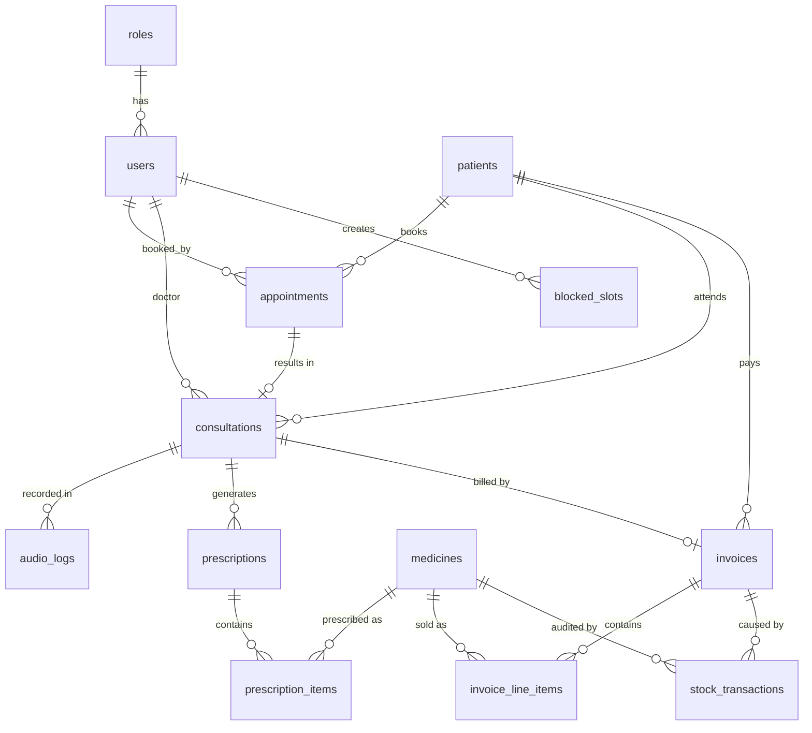

# Bhisakka — Database Design

PostgreSQL schema for the Bhisakka Ayurvedic Clinic Management System (C# WinForms + Npgsql).
Verified against **PostgreSQL 18** (works on 13+; no extensions required).

## Setup

```powershell
& 'C:\Program Files\PostgreSQL\18\bin\psql.exe' -U postgres -h localhost -c 'CREATE DATABASE bhisakka;'
& 'C:\Program Files\PostgreSQL\18\bin\psql.exe' -U postgres -h localhost -d bhisakka -f db\schema.sql
& 'C:\Program Files\PostgreSQL\18\bin\psql.exe' -U postgres -h localhost -d bhisakka -f db\seed.sql
```

Npgsql connection string:

```
Host=localhost;Database=bhisakka;Username=postgres;Password=<password>
```

Seeded dev logins (SHA-256 hashed in the DB): `doctor/doctor123`, `reception/reception123`, `pharmacy/pharmacy123`.

## Conventions

- **snake_case** identifiers, unquoted. The PascalCase names in the issues map 1:1 (`AudioSchedules` → `audio_schedules`).
- Integer PKs via `GENERATED ALWAYS AS IDENTITY` — never insert the ID yourself; use `RETURNING <pk>` to get it back.
- Money is `NUMERIC(10,2)` (maps to C# `decimal`). Never `float`/`double`.
- "Enums" are `TEXT` + `CHECK` constraints — pass plain strings from C#, the DB validates them.
- `TIMESTAMPTZ` for moments in time (C# `DateTimeOffset`/`DateTime`), `TIME` for clock times (C# `TimeOnly`/`TimeSpan`), `DATE` for dates (C# `DateOnly`).
- `day_of_week`: 0 = Sunday … 6 = Saturday — **matches .NET `System.DayOfWeek`**, so `(short)date.DayOfWeek` works directly.
- Always use **parameterized queries** (`@name` parameters in Npgsql). Never concatenate user input into SQL.

## Entity-Relationship Overview



Standalone tables (no FKs): `schedule_templates`, `app_settings`, `audio_schedules`.

## Tables

### Auth & staff
| Table | Purpose | Key columns |
|---|---|---|
| `roles` | Lookup: Doctor, Receptionist, Pharmacist | `role_name` UNIQUE |
| `users` | Staff logins | `username` UNIQUE, `password_hash` (SHA-256 hex), `role_id` FK, `is_active` |

### Patients
| Table | Purpose | Key columns |
|---|---|---|
| `patients` | Patient demographics (CRM) | `first_name`, `last_name`, `date_of_birth` (age is computed, not stored), `gender`, `contact_number`, `address` |

### Scheduling
| Table | Purpose | Key columns |
|---|---|---|
| `schedule_templates` | The doctor's recurring daily routine | `day_of_week` (0=Sun), `block_type` ('Consultation'/'Break'), `start_time`, `end_time`, `slot_duration_minutes` (15/30, NULL for breaks) |
| `blocked_slots` | One-off "sudden blocks" for a specific date | `block_date`, `start_time`, `end_time`, `reason` |
| `appointments` | Booked slots + live queue state | `appointment_date`, `start_time`, `status` (Scheduled→Waiting→InProgress→Completed / Cancelled / NoShow), `queue_number` |
| `app_settings` | Key/value config | `booking_window_days = 3` (rolling window — enforced in app logic), `default_consultation_fee`, … |

**Double-booking protection:** a partial unique index `uq_appointments_slot` on `(appointment_date, start_time) WHERE status <> 'Cancelled'` — the second insert into the same slot fails at the DB level. Single-doctor clinic, so there is no doctor column on appointments.

**Slot generation** (Issue #3's `ScheduleManager`): take the day's `Consultation` template blocks, cut them into `slot_duration_minutes` pieces, then remove pieces overlapping `blocked_slots` for that date and pieces already taken in `appointments` (status ≠ Cancelled).

### Consultations & records
| Table | Purpose | Key columns |
|---|---|---|
| `consultations` | One row per doctor visit — the single source of truth behind "ConsultationNotes" / "MedicalRecord" / "ConsultationHistory" from the issues | `appointment_id` FK UNIQUE, `patient_id`, `doctor_id`, `diagnosis`, `notes`, `consultation_fee` |
| `audio_logs` | Liability recordings: **local file path only, never the audio blob** | `consultation_id` FK, `file_path`, `duration_seconds` |
| `prescriptions` | Created during consultation, fulfilled at billing | `consultation_id` FK, `is_fulfilled`, `fulfilled_at` |
| `prescription_items` | Medicines on a prescription | `medicine_id` FK, `quantity`, `dosage_instructions` |

### Pharmacy
| Table | Purpose | Key columns |
|---|---|---|
| `medicines` | Catalog + stock. Single-table inheritance mirroring the C# `Medicine` base class: `medicine_type` discriminates ('Arishta','Churna','Kashaya','Thaila','Guli','Other'); subclass-specific fields are nullable (`alcohol_content` for Arishta) | `name` UNIQUE, `unit_price`, `quantity_in_stock` CHECK ≥ 0, `reorder_level`, `expiry_date` |
| `stock_transactions` | Audit trail of every stock movement (± quantity) | `quantity_change` (negative = out), `transaction_type` ('Purchase','Dispense','Adjustment','Expired'), `invoice_id` FK |

### Billing
| Table | Purpose | Key columns |
|---|---|---|
| `invoices` | Invoice header. `total_amount = consultation_fee + subtotal − discount` | `payment_status` ('Pending','Paid','Cancelled'), `payment_method`, `paid_at` |
| `invoice_line_items` | Pharmacy sale lines; `description`/`unit_price` are snapshots at sale time | `line_total` is a **generated column** (`quantity * unit_price`) — never insert it |

**Atomic stock deduction (Issue #4):** invoice insert + line items + `UPDATE medicines SET quantity_in_stock = quantity_in_stock - @qty` + `stock_transactions` insert all inside one `NpgsqlTransaction`. If stock would go negative, the `CHECK (quantity_in_stock >= 0)` throws and the whole transaction rolls back.

### Ambiance
| Table | Purpose | Key columns |
|---|---|---|
| `audio_schedules` | Daily playlist for the `AudioScheduler` | `track_type` ('Pirith','Puja','AmbientMusic','Announcement'), `trigger_time` (TIME; **NULL = manual-only announcement**), `is_enabled` |

## Views

| View | For | Contents |
|---|---|---|
| `v_consultation_history` | Issue #7 | Per-patient visit timeline: date, diagnosis, notes, fee, aggregated "medicines_prescribed" string. Filter by `patient_id`. |
| `v_low_stock` | Issue #6 | Active medicines at/below `reorder_level` or expiring within 30 days, with an `alert_type` column. |
| `v_daily_revenue` | Issue #4 | Paid invoices grouped by day: consultation vs pharmacy revenue, discounts, totals. |

## Table → Issue ownership

| Issue | Owns | Reads / depends on |
|---|---|---|
| #1 ambiance engine | `audio_schedules` | — |
| #2 audio auditing | `audio_logs` | `consultations` (#5) |
| #3 schedule engine | `schedule_templates`, `blocked_slots`, `app_settings` | `appointments` (#9) for slot subtraction |
| #4 billing | `invoices`, `invoice_line_items`, `stock_transactions`, `v_daily_revenue` | `medicines` (#6), `prescriptions` (#5), `consultations` (#5) |
| #5 queue & workspace | `consultations`, `prescriptions`, `prescription_items`; drives `appointments.status` | `appointments` (#9), `patients` (#8), `medicines` (#6) |
| #6 pharmacy catalog | `medicines`, `v_low_stock` | — |
| #7 history | `v_consultation_history` | `consultations` (#5) |
| #8 patient registration | `patients` | — |
| #9 booking (clerk) | inserts into `appointments` | slot logic from #3, `patients` (#8) |
| #10 login | `users`, `roles` | — |

## Password hashing (Issue #10)

Store lowercase-hex SHA-256, compare hashes:

```csharp
static string Hash(string password) =>
    Convert.ToHexString(SHA256.HashData(Encoding.UTF8.GetBytes(password))).ToLower();
```

```sql
SELECT u.user_id, u.full_name, r.role_name
FROM users u JOIN roles r ON r.role_id = u.role_id
WHERE u.username = @username AND u.password_hash = @hash AND u.is_active;
```

(SHA-256 is acceptable for this coursework; a production system would use bcrypt/argon2.)

## Rules enforced in application logic (not the schema)

- **Rolling 3-day booking window** — read `booking_window_days` from `app_settings`; the booking form's date picker allows only `today … today + N`.
- **Queue ordering** — assign `queue_number` at check-in (`MAX(queue_number) + 1` for the day).
- **Invoice totals** — the `Invoice` class computes `total_amount`; the DB validates it is ≥ 0.
